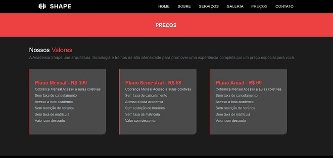

# SITE ACADEMIA

Esse site foi desenvolvido tendo um site de referência e dessa forma criei o código do zero, da minha própria maneira. Foram utilizados HTML, CSS, Js, um pouco de PHP e Ajax, em um total de 6 telas.  
 

Foi utilizado muito Flexbox para organizar os containers com justify-content, align-items e flex-direction. Estão presentes recursos como accordion e tabs.
 

 

 

Foi feita a formatação de formulário, estilizando campos e botão.

 
Possui mobile-navbar porém a responsividade ainda não está 100%. Esse projeto será aperfeiçoado.

## Checklist:

- [x] Telas 
- [x] Navegação
- [ ] Responsividade com media queries
- [ ] Aperfeiçoar envio de e-mail com PHP e Ajax
